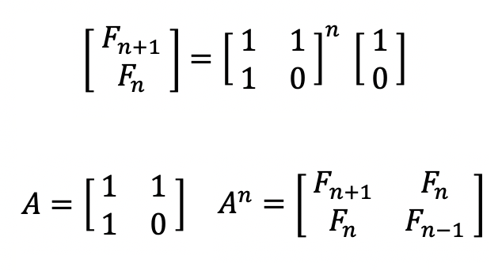

<br>

# 문제

피보나치 수는 0과 1로 시작한다. 0번째 피보나치 수는 0이고, 1번째 피보나치 수는 1이다. 그 다음 2번째 부터는 바로 앞 두 피보나치 수의 합이 된다.

이를 식으로 써보면 Fn = Fn-1 + Fn-2 (n ≥ 2)가 된다.

n=17일때 까지 피보나치 수를 써보면 다음과 같다.

0, 1, 1, 2, 3, 5, 8, 13, 21, 34, 55, 89, 144, 233, 377, 610, 987, 1597

n이 주어졌을 때, n번째 피보나치 수를 구하는 프로그램을 작성하시오.

<br>

# 입력

첫째 줄에 n이 주어진다. n은 1,000,000,000,000,000,000보다 작거나 같은 자연수이다.

<br>

# 출력

첫째 줄에 n번째 피보나치 수를 1,000,000,007으로 나눈 나머지를 출력한다.

<br>

# 풀이

`재귀`, 또는 `DP`의 기본 연습 문제로 꼽히는 피보나치 문제이다. 다만, `n`의 최댓값이 `1,000,000,000,000,000,000`이다! 단순한 방법으로는 풀이할 수 없고, 선형방정식과 행렬 연산을 통해 다음과 같은 피보나치 수의 일반항을 통해 풀 수 있다.

## 행렬로 표현한 피보나치 수 일반항



자세한 유도 과정은 [여기](https://st-lab.tistory.com/252)에서 확인할 수 있다.

핵심은 위와 같은 `A` 행렬을 `n`제곱하는 것만으로도 `n`번째 피보나치 수를 구할 수 있다는 것이다.

## 분할 정복을 이용한 행렬의 곱셈

이렇게 일반항을 구해냈다 하더라도 제곱 횟수가 만만치 않다. 하지만 제곱을 **고속화** 하는 데에는 이미 `분할 정복`이라는 널리 알려진 기법이 있다. `분할 정복`과 `메모이제이션`을 이용하면 다음과 같이 제곱에 대하여 고속 연산이 가능하다.

```c++
int cache[MAX]; // 메모이제이션

// n의 m 제곱수 구하기
int solve(int n, int m) {
    if (m == 1) return n;
    if (cache[m] != -1) return cache[m];
    if (m%2 == 0) return cache[m] = solve(n, m/2) * solve(n, m/2);
    else return cache[m] = n * solve(n, m-1);
}
```

시간복잡도는 **O(logN)** 임을 알 수 있다. 위 코드에서 정수의 제곱이 아닌 **행렬**의 제곱으로 `메모이제이션` 자료구조의 변경과 **행렬 곱셈** 코드를 따로 작성해주면 문제를 해결할 수 있다.

<br>

# 전체 코드

```c++
#include <bits/stdc++.h>
#define ll long long
#define MOD 1000000007
using namespace std;

typedef vector<vector<ll>> matrix;

map<ll,matrix> cache;

matrix multipleMatrix(const matrix& a, const matrix& b) {
    matrix ret(2, vector<ll>(2));
    for(int i=0;i<2;i++){
        for(int j=0;j<2;j++){
            for(int k=0;k<2;k++)
                ret[i][j] += a[i][k]*b[k][j];
            ret[i][j] %= MOD;
        }
    }
    return ret;
}

matrix solve(ll n, matrix& matr) {
    if (n == 1) return matr;
    if (cache.find(n) != cache.end()) return cache[n];
    if (n & 1) return cache[n] = multipleMatrix(matr, solve(n-1, matr));
    else return cache[n] = multipleMatrix(solve(n/2, matr), solve(n/2, matr));
}

int main() {
    ll N; cin >> N;
    matrix base = {{1,1}, {1,0}};
    matrix result = solve(N, base);
    cout << result[0][1];
    return 0;
}
```